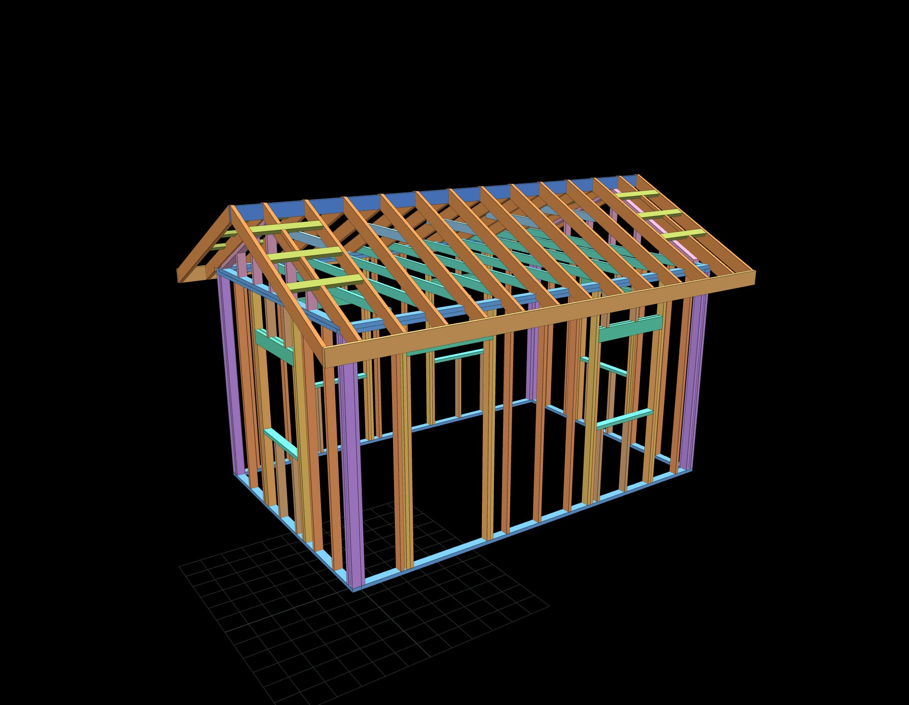

# Timber·Framer

A free, open-source, single-file framing generator for **stud walls and roofs**. Lay out a shed or small structure in your browser and get a live 3D frame, a piece-by-piece cut list, and a lumber buy-list — no install, no account, no server.

> ⚠️ **Not engineered.** Timber·Framer is a heuristic design aid, **not** a substitute for a structural engineer or your local building department. It does not certify spans, headers, uplift, or connections. Verify everything against the building code and span tables for your species, grade, spacing, and snow/wind loads before you build.

## Features

- **Branching stud-wall layouts** — chain walls off one another with clean corners and T / + junctions (2-, 3-, and 4-stud corner techniques), not just rectangles. Name each wall and jump to a head-on (elevation) view to edit it.
- **Door & window openings** — built-up (plies + plywood spacer) or solid timber headers, a load-bearing toggle, and flexible placement: measure the position **from the start, from the end, or centered**.
- **Roofs** — **gable** and **shed / mono-pitch**: cut rafters with birdsmouth seat cuts and plumb tails, ridge board, knee walls, rake overhangs with lookouts, subfascia, gable-end infill, ceiling joists, and collar ties.
- **Cut list & buy-list** — every stick tallied and bin-packed into stock lengths, with board-feet and a plain-English rationale for the framing decisions.
- **Interactive 3D** — orbit / zoom / pan, click any piece to inspect it, and see per-wall weights so you know what can be lifted.
- **Local & private** — runs entirely in your browser; designs are saved to local storage and can be exported / imported as JSON.

## Usage

Timber·Framer is a **single HTML file** with no build step. You can:

- **Open it directly** — download [`index.html`](index.html) and open it in any modern browser (Chrome, Edge, Firefox), or
- **Host it** — drop it on any static host. It works as a **GitHub Pages** site: enable Pages for this repository (Settings → Pages → deploy from the `main` branch) and visit the published URL.

Three.js is loaded from a CDN, so the only requirement is an internet connection on first load.

## Under the hood

A single self-contained `index.html`: HTML/CSS UI + vanilla JS, rendering with [Three.js](https://threejs.org/) (r128). The frame is one flat `members[]` array (each piece has a role, size, endpoints, and orientation) that is the single source of truth for the 3D view, the cut list, and the weight totals. The build is versioned with an in-app changelog (click the version badge in the header).

## Roadmap

Actively developed. On deck:

- Foundation section (piers / skids / slab / gravel base)
- A code-aware rules engine (when a header/ridge beam is required, jack counts, span-table sizing for snow load)
- Drag-to-place openings and a vent element type
- Hip and flat roofs, per-rectangle roof strategies

## Contributing

Bug reports and pull requests are welcome — see [CONTRIBUTING.md](CONTRIBUTING.md).

## License

[MIT](LICENSE) © 2026 BMXop19

---

> 🤖 _Authorship note: this README was written by an AI assistant._
